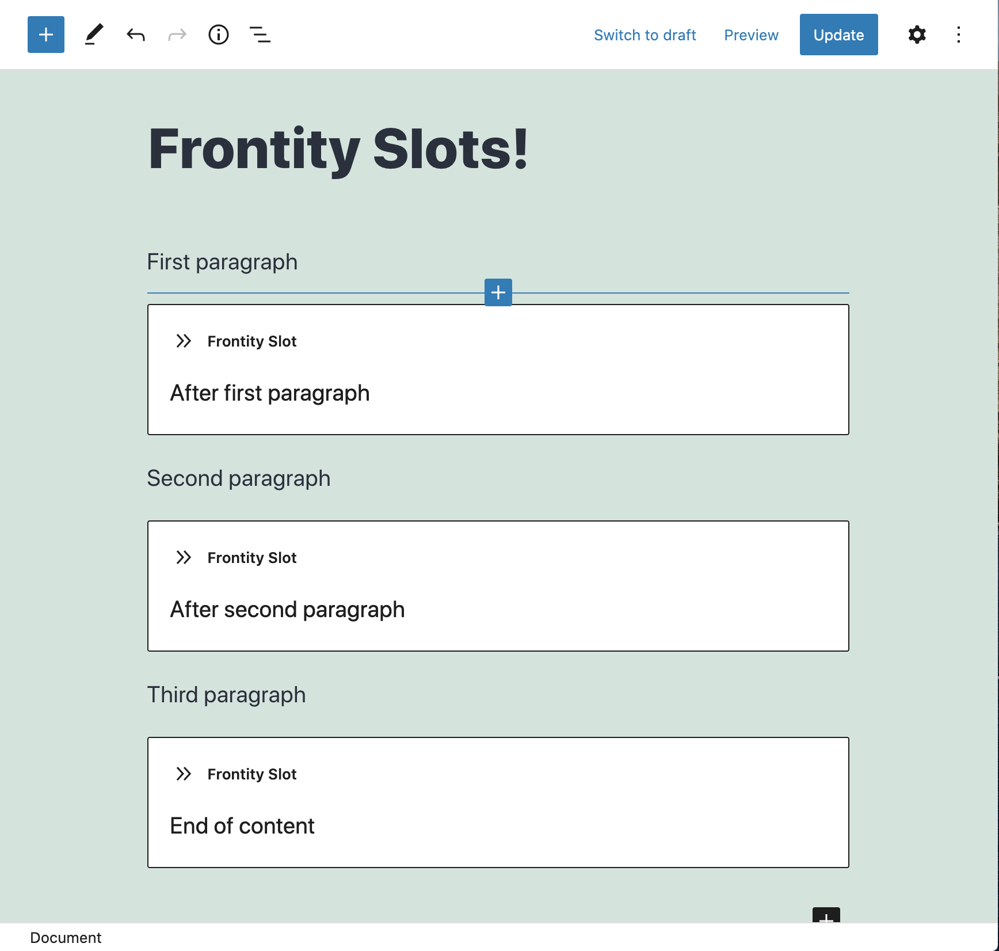
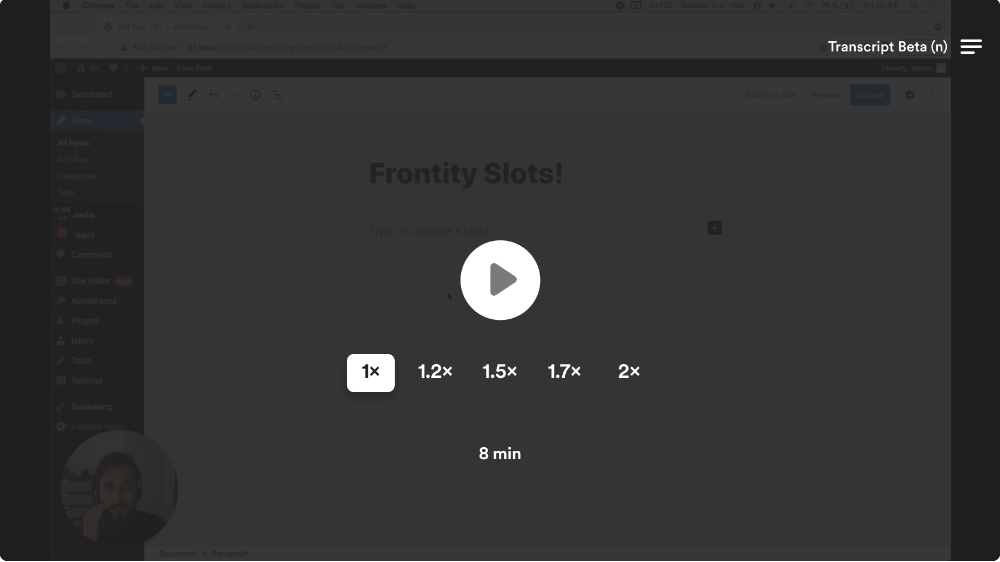

# Frontity Slot Block

Insert a Frontity Slot in the block editor (aka Gutenberg).

## Description

This plugin adds a new block to the block editor called _Frontity Slot_, that inserts a Frontity Slot directly in the content.



It requires the _Slot Block_ processor, which is exported in the `@frontity/html2react` package:

```js
import slotBlock from "@frontity/html2react/processors/slot-block";

export default {
  state: {
    // ...
  },
  actions: {
    // ...
  },
  libraries: {
    html2react: {
      processors: [slotBlock],
    },
  },
};
```

## Demo

[](https://www.loom.com/share/d0a0d91e6f5c47b08a2d3da3eaf32629)

## Feature Discussion

This Frontity feature is discussed at https://community.frontity.org/t/frontity-slot-block/4534. Feel free to join and participate.

## Installation

1. Upload the plugin files to the `/wp-content/plugins/frontity-slot` directory, or install the plugin through the WordPress plugins screen directly.
1. Activate the plugin through the 'Plugins' screen in WordPress

## Frequently Asked Questions

### What is the benefit of using this block instead of just an html2react processor?

Both approaches work, but using Frontity Slots is more explicit, clean, and should be easier to maintain.

## Frontity Channels 🌎

[](https://community.frontity.org/) [](https://twitter.com/frontity) 

There are different channels at your disposal where you can find information about the Frontity project, discuss it and get involved:

- 📖 **[Docs](https://docs.frontity.org)**: this is the place to learn how to build amazing sites with Frontity.
- 👨‍👩‍👧‍👦 **[Community](https://community.frontity.org/)**: use our forum to [ask any questions](https://community.frontity.org/c/dev-talk-questions), give feedback and meet great people. This is your place too to share [what are you building with Frontity](https://community.frontity.org/c/community/showcases/19)!
- 🐞 **[GitHub](https://github.com/frontity)**: we use GitHub only for bugs and pull requests. Questions are answered in the [community forum](https://community.frontity.org/)!
- 🗣 **Social media**: a more informal place to interact with Frontity users, reach out to us on [Twitter](https://twitter.com/frontity).
- 💌 **Newsletter**: do you want to receive the latest framework updates and news? Subscribe [here](https://frontity.org/).

### » Get involved 🤗

Got questions or feedback about Frontity? Use the [community forum](https://community.frontity.org) yo ! ❤️

The Frontity project also welcomes contributions. There are many ways to support the project! If you don't know where to start, this guide might help: [How to contribute?](https://docs.frontity.org/contributing/how-to-contribute)
